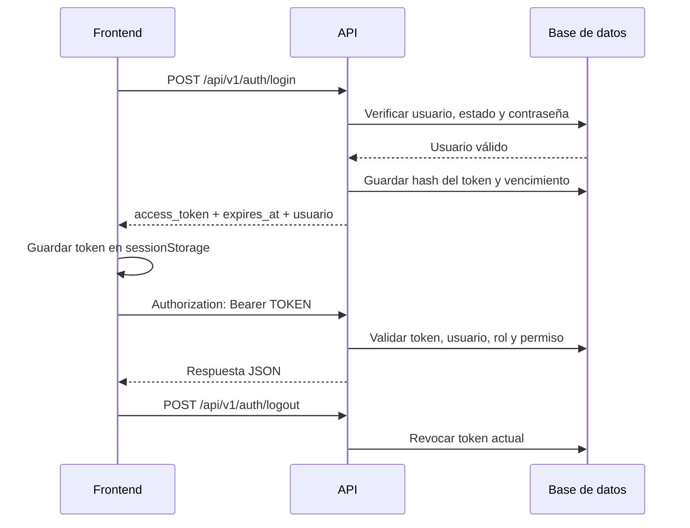

# Arquitectura web y API PHP

Laravel ocupa la raíz del proyecto y contiene tanto las vistas Blade como la
API JSON. Las dos capas permanecen separadas a nivel de rutas y
responsabilidades, pero se sirven desde la misma aplicación y dominio.

## Direcciones locales recomendadas

- Aplicación: `http://sistema-pollos.test`
- Vistas web: `http://sistema-pollos.test/`
- Base de la API: `http://sistema-pollos.test/api/v1`

En Laragon, el host debe apuntar a `public/`, nunca a la raíz completa del
proyecto.

## Vistas actuales

| Ruta | Vista Blade | Estado |
|---|---|---|
| `/` | `menu.blade.php` | Usa el comportamiento actual |
| `/operacion` | `operacion.blade.php` | Usa `localStorage`; sin conexión a tablas |
| `/directorio` | `directorio.blade.php` | Conectada a la API de clientes y proveedores |
| `/directorio/clientes/{id}` | `cliente-detalle.blade.php` | Tickets, pesadas e histórico de precios |
| `/directorio/proveedores/{id}` | `proveedor-detalle.blade.php` | Pesadas, destinos y placas asignadas |

La migración a la API se realiza módulo por módulo. La vista de operación
continúa pendiente.

## Flujo de autenticación



Sanctum almacena únicamente el hash del token. El valor completo se devuelve
una sola vez durante el login.

## Endpoints iniciales

| Método | Endpoint | Protección |
|---|---|---|
| `GET` | `/api/v1/health` | Público |
| `POST` | `/api/v1/auth/login` | Público, máximo 5 intentos/minuto |
| `GET` | `/api/v1/auth/me` | Token Bearer |
| `POST` | `/api/v1/auth/logout` | Token Bearer |
| `POST` | `/api/v1/auth/logout-all` | Token Bearer |
| `GET` | `/api/v1/clientes?buscar=` | Token Bearer; acceso público temporal en local |
| `POST` | `/api/v1/clientes` | Token Bearer; acceso público temporal en local |
| `PUT` | `/api/v1/clientes/{id}` | Token Bearer; acceso público temporal en local |
| `DELETE` | `/api/v1/clientes/{id}` | Token Bearer; acceso público temporal en local |
| `GET` | `/api/v1/clientes/{id}/historial` | Token Bearer; acceso público temporal en local |
| `GET` | `/api/v1/proveedores?buscar=` | Token Bearer; acceso público temporal en local |
| `POST` | `/api/v1/proveedores` | Token Bearer; acceso público temporal en local |
| `PUT` | `/api/v1/proveedores/{id}` | Token Bearer; acceso público temporal en local |
| `DELETE` | `/api/v1/proveedores/{id}` | Token Bearer; acceso público temporal en local |
| `GET` | `/api/v1/proveedores/{id}/historial` | Token Bearer; acceso público temporal en local |
| `POST` | `/api/v1/proveedores/{id}/vehiculos` | Token Bearer; acceso público temporal en local |
| `DELETE` | `/api/v1/proveedores/{id}/vehiculos/{asignacion}` | Token Bearer; acceso público temporal en local |

Los endpoints del directorio buscan exclusivamente por nombre o número de
documento. La creación registra el tercero, su rol y su lista de precios con
historial. Un mismo documento puede tener los roles `CLIENTE` y `PROVEEDOR`
sin duplicar la fila de `terceros`.

El endpoint de historial admite los parámetros:

- `ticket`: búsqueda parcial por código;
- `fecha_desde`: fecha operativa inicial en formato `YYYY-MM-DD`;
- `fecha_hasta`: fecha operativa final en formato `YYYY-MM-DD`;
- `page` y `per_page`: paginación de tickets.

La respuesta incluye los registros de pesada de cada ticket, precios
congelados, totales filtrados e historial completo de la lista de venta del
cliente.

El historial del proveedor consulta directamente las filas de `pesadas` donde
el proveedor figura como origen. Cada resultado incluye el ticket, la placa y
el destino, que puede ser un cliente o un almacén. Admite filtros por código de
ticket, placa y rango de fechas.

Para asignar un camión a un proveedor solo se envía `placa`. La API la
normaliza a mayúsculas, reutiliza el vehículo si ya existe y crea la relación
en `proveedor_vehiculos`. Una placa no puede estar asignada activamente a dos
proveedores al mismo tiempo. Al retirarla se desactiva la relación sin borrar
el vehículo ni su historial.

Durante el desarrollo puede utilizarse:

```dotenv
DIRECTORY_API_PUBLIC=true
```

En producción debe configurarse en `false`; en ese modo se exige Sanctum,
usuario activo y el permiso `TERCEROS_GESTIONAR`.

Ejemplo de login:

```json
{
  "email": "administrador@empresa.pe",
  "password": "contraseña",
  "device_name": "pc-balanza-1"
}
```

Ejemplo de consulta protegida:

```http
GET /api/v1/auth/me HTTP/1.1
Accept: application/json
Authorization: Bearer 1|token...
```

## Autenticación y autorización

El token identifica la sesión, pero no decide por sí solo qué puede hacer el
usuario. En cada solicitud protegida se verifica que el usuario continúe
activo, y en cada acción sensible se consultan sus roles y permisos actuales en
la base.

Ejemplo futuro:

```php
Route::post('/precios', ...)
    ->middleware(['auth:sanctum', 'active', 'permission:PRECIOS_GESTIONAR']);
```

De esta manera, retirar un permiso impide nuevas operaciones aunque el usuario
todavía tenga un token vigente.

## Almacenamiento en el frontend

El archivo `api-client.js` guarda el token en `sessionStorage`, lo adjunta a
cada solicitud y lo elimina al recibir un `401`.

Se eligió `sessionStorage` porque limita la sesión a la pestaña actual. Un token
en `localStorage` permanece después de cerrar el navegador y aumenta el impacto
de una vulnerabilidad XSS. En ambos casos el frontend debe evitar insertar HTML
no confiable y el sitio debe usar HTTPS en producción.

Nunca deben guardarse en el navegador:

- contraseña;
- hash de contraseña;
- permisos asumidos como fuente de verdad;
- credenciales de base de datos;
- claves de aplicación del backend.

## Configuración

Copiar `.env.example` como `.env` y completar:

```dotenv
APP_URL=http://sistema-pollos.test
FRONTEND_URLS=http://sistema-pollos.test
DB_DATABASE=sistema_pollos
DB_USERNAME=root
DB_PASSWORD=
AUTH_TOKEN_EXPIRATION_MINUTES=720
ADMIN_EMAIL=administrador@empresa.pe
ADMIN_PASSWORD=una-clave-segura
```

Después:

```bash
php artisan migrate --seed
```

`ADMIN_PASSWORD` solo se utiliza para crear o actualizar el administrador
inicial mediante el seeder. No debe subirse al repositorio.

## Reglas para los siguientes módulos

1. Todos los endpoints se publican bajo `/api/v1`.
2. Los controladores no confían en IDs, precios, totales, usuario o permisos
   calculados por el frontend.
3. Los datos se validan con Form Requests.
4. Las respuestas se transforman con API Resources.
5. Operaciones como generar ticket utilizan transacciones de base de datos.
6. Cada creación o modificación guarda el usuario obtenido del token.
7. Cambios de precios, anulaciones y recepciones no programadas verifican un
   permiso explícito y generan auditoría.
8. CORS admite exclusivamente los dominios declarados en `FRONTEND_URLS`.
9. En producción se utiliza HTTPS y `APP_DEBUG=false`.
