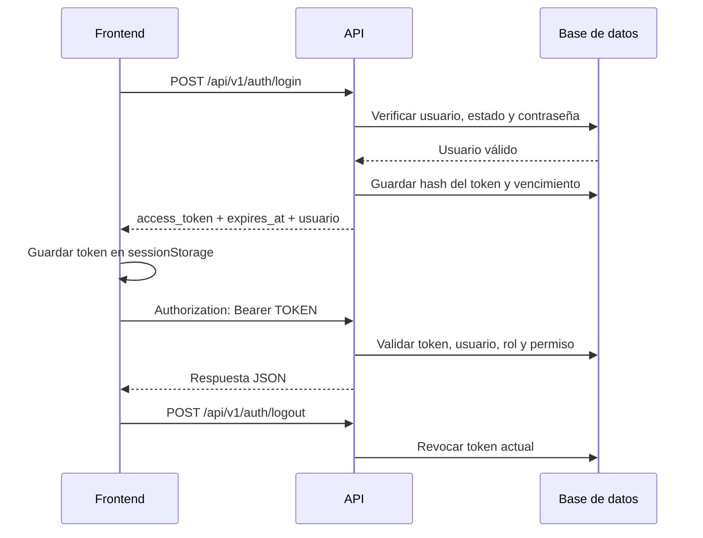

# Arquitectura web y API PHP

Laravel ocupa la raíz del proyecto y contiene tanto las vistas Blade como la
API JSON. Las dos capas permanecen separadas a nivel de rutas y
responsabilidades, pero se sirven desde la misma aplicación y dominio.

## Direcciones locales recomendadas

- Aplicación: `http://sistema-pollos.test`
- Vistas web: `http://sistema-pollos.test/`
- Base de la API: `http://sistema-pollos.test/api/v1`

En Laragon, el host debe apuntar a `public/`, nunca a la raíz completa del
proyecto.

## Vistas actuales

| Ruta | Vista Blade | Estado |
|---|---|---|
| `/` | `menu.blade.php` | Usa el comportamiento actual |
| `/operacion` | `operacion.blade.php` | Usa `localStorage`; sin conexión a tablas |
| `/directorio` | `directorio.blade.php` | Conectada a la API de clientes y proveedores |
| `/flota` | `flota.blade.php` | Camiones y choferes propios de la empresa |
| `/directorio/clientes/{id}` | `cliente-detalle.blade.php` | Tickets, pesadas e histórico de precios |
| `/directorio/proveedores/{id}` | `proveedor-detalle.blade.php` | Pesadas, destinos y placas asignadas |
| `/finanzas` | `finanzas-menu.blade.php` | Portada con las cuatro áreas financieras |
| `/finanzas/saldos` | `finanzas.blade.php` | Saldos, cartera y trazabilidad financiera |
| `/finanzas/entidades` | `finanzas-entidades.blade.php` | Empresas receptoras y cuentas propias/externas |
| `/finanzas/movimientos/nuevo` | `finanzas-movimiento.blade.php` | Registro de cobros, pagos y reembolsos |
| `/compras` | `compras.blade.php` | Compras explícitas, CXP y registros históricos `LEGADO` |
| `/compras/nueva` | `compra-form.blade.php` | Registro de compras al contado o a crédito |

La migración a la API se realiza módulo por módulo. La vista de operación
continúa pendiente.

## Flujo de autenticación



Sanctum almacena únicamente el hash del token. El valor completo se devuelve
una sola vez durante el login.

## Endpoints iniciales

| Método | Endpoint | Protección |
|---|---|---|
| `GET` | `/api/v1/health` | Público |
| `POST` | `/api/v1/auth/login` | Público, máximo 5 intentos/minuto |
| `GET` | `/api/v1/auth/me` | Token Bearer |
| `POST` | `/api/v1/auth/logout` | Token Bearer |
| `POST` | `/api/v1/auth/logout-all` | Token Bearer |
| `GET` | `/api/v1/clientes?buscar=` | Token Bearer; acceso público temporal en local |
| `POST` | `/api/v1/clientes` | Token Bearer; acceso público temporal en local |
| `PUT` | `/api/v1/clientes/{id}` | Token Bearer; acceso público temporal en local |
| `DELETE` | `/api/v1/clientes/{id}` | Token Bearer; acceso público temporal en local |
| `GET` | `/api/v1/clientes/{id}/historial` | Token Bearer; acceso público temporal en local |
| `GET` | `/api/v1/proveedores?buscar=` | Token Bearer; acceso público temporal en local |
| `POST` | `/api/v1/proveedores` | Token Bearer; acceso público temporal en local |
| `PUT` | `/api/v1/proveedores/{id}` | Token Bearer; acceso público temporal en local |
| `DELETE` | `/api/v1/proveedores/{id}` | Token Bearer; acceso público temporal en local |
| `GET` | `/api/v1/proveedores/{id}/historial` | Token Bearer; acceso público temporal en local |
| `POST` | `/api/v1/proveedores/{id}/vehiculos` | Token Bearer; acceso público temporal en local |
| `DELETE` | `/api/v1/proveedores/{id}/vehiculos/{asignacion}` | Token Bearer; acceso público temporal en local |
| `GET, POST` | `/api/v1/camiones` | `TERCEROS_GESTIONAR`; acceso público temporal en local |
| `GET, PUT, PATCH, DELETE` | `/api/v1/camiones/{id}` | `TERCEROS_GESTIONAR`; acceso público temporal en local |
| `GET, POST` | `/api/v1/choferes` | `TERCEROS_GESTIONAR`; acceso público temporal en local |
| `GET, PUT, PATCH, DELETE` | `/api/v1/choferes/{id}` | `TERCEROS_GESTIONAR`; acceso público temporal en local |
| `GET` | `/api/v1/operacion/catalogo` | `DESPACHOS_VER`; acceso público temporal en local |
| `GET` | `/api/v1/operacion/clientes` | `DESPACHOS_VER`; acceso público temporal en local |
| `GET` | `/api/v1/operacion/proveedores` | `DESPACHOS_VER`; acceso público temporal en local |
| `POST` | `/api/v1/operacion/tickets` | `DESPACHOS_CREAR`; acceso público temporal en local |
| `GET` | `/api/v1/compras/catalogo` | `COMPRAS_VER` |
| `GET` | `/api/v1/compras` | `COMPRAS_VER` |
| `GET` | `/api/v1/compras/{id}` | `COMPRAS_VER` |
| `POST` | `/api/v1/compras` | `COMPRAS_REGISTRAR` |
| `POST` | `/api/v1/compras/{id}/anular` | `COMPRAS_ANULAR` |

Los endpoints del directorio buscan exclusivamente por nombre o número de
documento. La creación registra el tercero, su rol y su lista de precios con
historial. Un mismo documento puede tener los roles `CLIENTE` y `PROVEEDOR`
sin duplicar la fila de `terceros`.

El endpoint de historial admite los parámetros:

- `ticket`: búsqueda parcial por código;
- `fecha_desde`: fecha operativa inicial en formato `YYYY-MM-DD`;
- `fecha_hasta`: fecha operativa final en formato `YYYY-MM-DD`;
- `page` y `per_page`: paginación de tickets.

La respuesta incluye los registros de pesada de cada ticket, precios
congelados, totales filtrados e historial completo de la lista de venta del
cliente.

El historial del proveedor consulta directamente las filas de `pesadas` donde
el proveedor figura como origen. Cada resultado incluye el ticket, la placa y
el destino, que puede ser un cliente o un almacén. Admite filtros por código de
ticket, placa y rango de fechas.

Para asignar un camión a un proveedor solo se envía `placa`. La API la
normaliza a mayúsculas, reutiliza el vehículo si ya existe y crea la relación
en `proveedor_vehiculos`. Una placa no puede estar asignada activamente a dos
proveedores al mismo tiempo. Al retirarla se desactiva la relación sin borrar
el vehículo ni su historial.

El catálogo de camiones propios recibe `placa` y, opcionalmente, `marca`,
`modelo`, `color` y `descripcion`. El catálogo de choferes requiere únicamente
`nombre_completo`; `tipo_documento`, `numero_documento` y `telefono` son
opcionales. Si se proporciona alguno de los dos campos de documento, deben
enviarse ambos. Los dos catálogos admiten búsqueda con `buscar`, paginación con
`per_page` y eliminación lógica para conservar el historial operativo. Los
choferes no tienen ninguna relación con los camiones.

## Registro transaccional de tickets

La pantalla operativa conserva las pesadas en el navegador mientras el ticket
sea un borrador. No se crea ninguna fila en `tickets_despacho`, `ticket_precios`
o `pesadas` al pulsar **Agregar registro**.

Al pulsar **Registrar ticket**, el frontend envía el destino y todas las
pesadas a `POST /api/v1/operacion/tickets`. La pantalla de despacho no muestra,
envía ni administra precios. La API resuelve internamente la lista vigente del
cliente y usa la lista general vigente como respaldo; si la configuración
interna necesaria no existe, rechaza el ticket completo. La API ejecuta en una
sola transacción:

1. validación de cliente o almacén de destino;
2. resolución de la jornada operativa;
3. generación del código correlativo;
4. congelamiento de precios en `ticket_precios`;
5. validación de proveedores, placas, almacenes, tipos de pollo y javas;
6. recálculo de aves, tara y peso neto;
7. creación del ticket cerrado y todas sus pesadas.

Si falla cualquier pesada, la transacción se revierte completa. El campo
`referencia_externa` contiene el UUID del borrador y evita duplicados cuando
una solicitud se reintenta.

Al cerrar el ticket se crea o sincroniza únicamente el comprobante de venta y
la CXC del cliente. El proveedor, la placa y el producto de origen permanecen
en cada pesada para consultar qué proveedor atendió a qué cliente, pero el
despacho no crea una CXP nueva. La deuda con el proveedor nace en el módulo de
Compras, no por inferencia desde las pesadas.

Cuando se actualiza el precio específico de un cliente, la misma transacción
revaloriza sus `ticket_precios` correspondientes a la jornada operativa
vigente. Esto cubre despachos realizados después del corte de las 9:00 p. m.
que se cobran durante la mañana siguiente. Los tickets de jornadas anteriores
no se modifican y cada cambio queda registrado en `auditoria_eventos`.

## Registro transaccional de compras

`POST /api/v1/compras` recibe el proveedor, documento, condición de pago y sus
detalles. El backend recalcula cada subtotal y el total, y usa una clave UUID de
idempotencia para que un reintento idéntico no duplique la operación.

- Una compra `CREDITO` crea la compra y un comprobante `COMPRA` de naturaleza
  `CARGO`; el total queda como CXP pendiente.
- Una compra `CONTADO` crea además un `PAGO_PROVEEDOR` totalmente aplicado al
  mismo comprobante; la CXP queda pagada y disminuye la cuenta propia elegida.
- Un `PAGO_DIRECTO` de un cliente al proveedor aplica exactamente el mismo
  importe al conjunto de CXC y al conjunto de CXP seleccionadas, reduciendo
  ambas obligaciones sin afectar una cuenta propia.
- Un `COBRO_CLIENTE` depositado a la avícola reduce la CXC y aumenta el saldo
  propio, pero no reduce la CXP.

Las CXP generadas por el modelo anterior se identifican por
`origen_clave = COMPRA:TICKET:*` y se importan como compras `LEGADO`. La compra
histórica queda vinculada al comprobante ya existente y copia sus detalles para
consulta. No se crean comprobantes ni pagos adicionales y no se alteran el
saldo pendiente, las aplicaciones o el estado financiero original.

Las consultas y mutaciones exigen Sanctum y usuario activo. Además de
`COMPRAS_VER`, `COMPRAS_REGISTRAR` o `COMPRAS_ANULAR`, una compra al contado
requiere permiso para registrar pagos y su anulación requiere permiso para
anularlos. El pago inicial no se puede anular directamente desde Finanzas: la
reversa debe iniciarse desde la compra. El listado y el resumen del proveedor
aceptan `moneda` para consultar cada cartera sin mezclar divisas.

Los datos de identificación del proveedor se leen del snapshot del comprobante
y el número de documento solo es único entre compras activas. Una anulación
conserva el documento histórico y permite registrar después una captura
corregida con el mismo número.

Durante el desarrollo puede utilizarse:

```dotenv
DIRECTORY_API_PUBLIC=true
```

En producción debe configurarse en `false`; en ese modo se exige Sanctum,
usuario activo y el permiso `TERCEROS_GESTIONAR`.

Ejemplo de login:

```json
{
  "email": "administrador@empresa.pe",
  "password": "contraseña",
  "device_name": "pc-balanza-1"
}
```

Ejemplo de consulta protegida:

```http
GET /api/v1/auth/me HTTP/1.1
Accept: application/json
Authorization: Bearer 1|token...
```

## Autenticación y autorización

El token identifica la sesión, pero no decide por sí solo qué puede hacer el
usuario. En cada solicitud protegida se verifica que el usuario continúe
activo, y en cada acción sensible se consultan sus roles y permisos actuales en
la base.

Ejemplo futuro:

```php
Route::post('/precios', ...)
    ->middleware(['auth:sanctum', 'active', 'permission:PRECIOS_GESTIONAR']);
```

De esta manera, retirar un permiso impide nuevas operaciones aunque el usuario
todavía tenga un token vigente.

## Almacenamiento en el frontend

El archivo `api-client.js` guarda el token en `sessionStorage`, lo adjunta a
cada solicitud y lo elimina al recibir un `401`.

Se eligió `sessionStorage` porque limita la sesión a la pestaña actual. Un token
en `localStorage` permanece después de cerrar el navegador y aumenta el impacto
de una vulnerabilidad XSS. En ambos casos el frontend debe evitar insertar HTML
no confiable y el sitio debe usar HTTPS en producción.

Nunca deben guardarse en el navegador:

- contraseña;
- hash de contraseña;
- permisos asumidos como fuente de verdad;
- credenciales de base de datos;
- claves de aplicación del backend.

## Configuración

Copiar `.env.example` como `.env` y completar:

```dotenv
APP_URL=http://sistema-pollos.test
FRONTEND_URLS=http://sistema-pollos.test
DB_DATABASE=sistema_pollos
DB_USERNAME=root
DB_PASSWORD=
AUTH_TOKEN_EXPIRATION_MINUTES=720
ADMIN_EMAIL=administrador@empresa.pe
ADMIN_PASSWORD=una-clave-segura
```

Después:

```bash
php artisan migrate --seed
```

`ADMIN_PASSWORD` solo se utiliza para crear o actualizar el administrador
inicial mediante el seeder. No debe subirse al repositorio.

## Reglas para los siguientes módulos

1. Todos los endpoints se publican bajo `/api/v1`.
2. Los controladores no confían en IDs, precios, totales, usuario o permisos
   calculados por el frontend.
3. Los datos se validan con Form Requests.
4. Las respuestas se transforman con API Resources.
5. Operaciones como generar ticket utilizan transacciones de base de datos.
6. Cada creación o modificación guarda el usuario obtenido del token.
7. Cambios de precios, anulaciones y recepciones no programadas verifican un
   permiso explícito y generan auditoría.
8. CORS admite exclusivamente los dominios declarados en `FRONTEND_URLS`.
9. En producción se utiliza HTTPS y `APP_DEBUG=false`.
