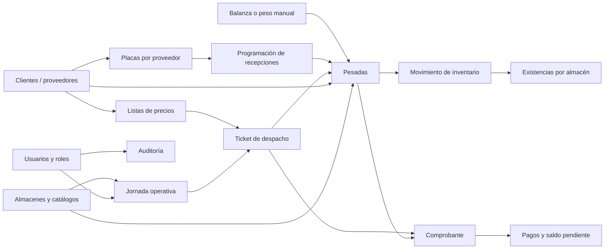
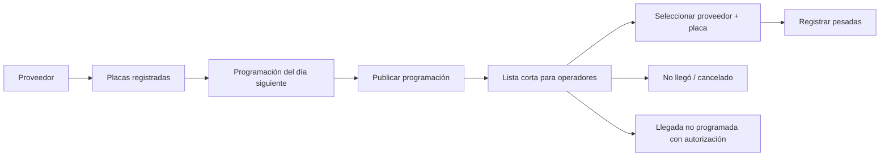
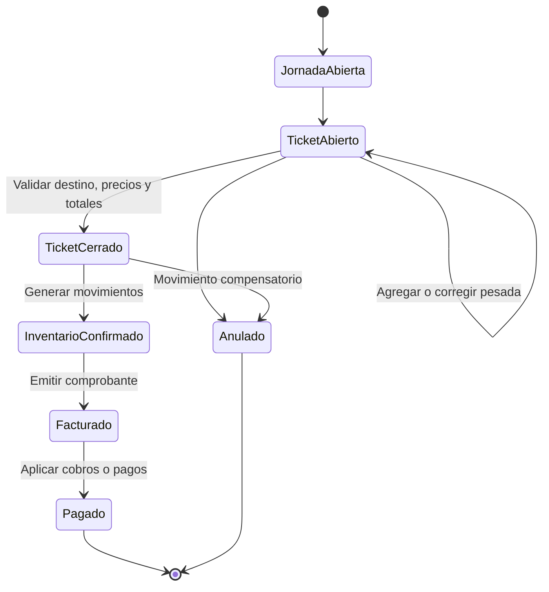

# Esquema propuesto de base de datos

Este documento define una estructura inicial para llevar el frontend actual de
**Sistema Pollos** a una base de datos relacional ordenada y preparada para
producción.

El diseño cubre:

- clientes y proveedores;
- precios de compra y venta por tipo de pollo;
- almacenes, vehículos, placas por proveedor, balanzas y tipos de java;
- programación diaria de proveedores y camiones esperados;
- jornadas de trabajo, tickets de despacho y pesadas;
- movimientos y existencias de inventario;
- comprobantes, pagos y facturación futura;
- usuarios, permisos y auditoría.

La propuesta es compatible conceptualmente con MySQL/MariaDB, que suele ser la
opción natural en un entorno Laragon. Todavía no es una migración SQL: es el
modelo que debe validarse antes de crear las tablas.

## 1. Configuración confirmada

| Decisión | Configuración |
|---|---|
| Empresa | Una sola empresa. `empresas` tendrá un único registro con los datos legales y generales. |
| País | Perú (`PE`). |
| Moneda | Sol peruano (`PEN`), mostrado como `S/`. |
| Zona horaria | `America/Lima`. |
| Corte operativo | Una jornada por fecha, con cambio de jornada a las 9:00 p. m. |
| SUNAT | Sin integración ni emisión fiscal electrónica. |
| Comprobantes | Documentos internos con código aleatorio o escrito manualmente al generar el ticket. |
| Transferencias | No requieren aprobación previa. |
| Conservación | Tickets, pesadas y lecturas utilizadas se conservan permanentemente. |

Aunque solo habrá una empresa, se conserva la tabla `empresas` porque centraliza
RUC, razón social, moneda, zona horaria y hora de corte. El sistema no tendrá
selector de empresa ni comportamiento multiempresa.

## 2. Flujo general

## 3. Diagrama entidad-relación

El archivo [esquema-base-datos.dbml](./esquema-base-datos.dbml) contiene el
modelo completo con columnas e índices. Puede importarse en una herramienta
compatible con DBML para verlo como diagrama.

```mermaid
erDiagram
    EMPRESAS ||--o{ SUCURSALES : tiene
    EMPRESAS ||--o{ USUARIOS : registra
    USUARIOS ||--o{ PERSONAL_ACCESS_TOKENS : inicia_sesion
    USUARIOS ||--o{ USUARIO_ROLES : recibe
    ROLES ||--o{ USUARIO_ROLES : agrupa
    ROLES ||--o{ ROL_PERMISOS : contiene
    PERMISOS ||--o{ ROL_PERMISOS : habilita

    EMPRESAS ||--o{ TERCEROS : administra
    TERCEROS ||--o{ TERCERO_ROLES : puede_ser
    TERCEROS o|--o{ LISTAS_PRECIOS : posee
    LISTAS_PRECIOS ||--o{ PRECIOS_HISTORIAL : versiona
    TIPOS_POLLO ||--o{ PRECIOS_HISTORIAL : valoriza
    USUARIOS ||--o{ PRECIOS_HISTORIAL : registra

    SUCURSALES ||--o{ ALMACENES : contiene
    SUCURSALES ||--o{ BALANZAS : utiliza
    EMPRESAS ||--o{ VEHICULOS : registra
    EMPRESAS ||--o{ CONDUCTORES : registra
    CONDUCTORES o|--o{ VEHICULOS : conductor_habitual
    TERCEROS ||--o{ PROVEEDOR_VEHICULOS : utiliza
    VEHICULOS ||--o{ PROVEEDOR_VEHICULOS : se_asigna
    SUCURSALES ||--o{ PROGRAMACIONES_RECEPCION : organiza
    PROGRAMACIONES_RECEPCION ||--o{ PROGRAMACION_RECEPCION_DETALLES : contiene
    PROVEEDOR_VEHICULOS ||--o{ PROGRAMACION_RECEPCION_DETALLES : programa
    CONDUCTORES o|--o{ PROGRAMACION_RECEPCION_DETALLES : conduce
    SUCURSALES ||--o{ JORNADAS_OPERATIVAS : abre
    USUARIOS ||--o{ JORNADAS_OPERATIVAS : opera

    JORNADAS_OPERATIVAS ||--o{ TICKETS_DESPACHO : agrupa
    TERCEROS o|--o{ TICKETS_DESPACHO : cliente_destino
    ALMACENES o|--o{ TICKETS_DESPACHO : almacen_destino
    TICKETS_DESPACHO ||--o{ TICKET_PRECIOS : congela
    TIPOS_POLLO ||--o{ TICKET_PRECIOS : aplica
    PRECIOS_HISTORIAL ||--o{ TICKET_PRECIOS : origina

    BALANZAS ||--o{ LECTURAS_BALANZA : produce
    TICKETS_DESPACHO ||--o{ PESADAS : contiene
    TIPOS_POLLO ||--o{ PESADAS : clasifica
    TIPOS_JAVA ||--o{ PESADAS : descuenta_tara
    LECTURAS_BALANZA o|--o| PESADAS : respalda
    TERCEROS o|--o{ PESADAS : proveedor_origen
    ALMACENES o|--o{ PESADAS : almacen_origen
    VEHICULOS o|--o{ PESADAS : transporta
    PROGRAMACION_RECEPCION_DETALLES o|--o{ PESADAS : origina

    TICKETS_DESPACHO ||--o{ MOVIMIENTOS_INVENTARIO : genera
    MOVIMIENTOS_INVENTARIO ||--o{ MOVIMIENTO_DETALLES : contiene
    PESADAS ||--o| MOVIMIENTO_DETALLES : sustenta
    ALMACENES o|--o{ MOVIMIENTOS_INVENTARIO : origen
    ALMACENES o|--o{ MOVIMIENTOS_INVENTARIO : destino
    ALMACENES ||--o{ EXISTENCIAS_ALMACEN : mantiene
    TIPOS_POLLO ||--o{ EXISTENCIAS_ALMACEN : acumula

    EMPRESAS ||--o{ COMPROBANTES : emite
    TERCEROS ||--o{ COMPROBANTES : contraparte
    COMPROBANTES ||--o{ COMPROBANTE_DETALLES : detalla
    COMPROBANTES ||--o{ COMPROBANTE_TICKETS : relaciona
    TICKETS_DESPACHO ||--o{ COMPROBANTE_TICKETS : factura
    COMPROBANTES ||--o{ COMPROBANTE_PESADAS : relaciona
    PESADAS ||--o{ COMPROBANTE_PESADAS : sustenta
    TERCEROS ||--o{ PAGOS : realiza_recibe
    PAGOS ||--o{ PAGO_APLICACIONES : distribuye
    COMPROBANTES ||--o{ PAGO_APLICACIONES : cancela

    USUARIOS ||--o{ AUDITORIA_EVENTOS : ejecuta
```

## 4. Tablas por módulo

### Configuración y seguridad

| Tabla | Responsabilidad |
|---|---|
| `empresas` | Datos legales y configuración principal del negocio. |
| `sucursales` | Locales o centros operativos de la empresa. |
| `usuarios` | Acceso de operadores y administradores. |
| `personal_access_tokens` | Hash, dispositivo, capacidades, uso y vencimiento de cada sesión API. |
| `roles`, `permisos` | Catálogo de perfiles y acciones permitidas. |
| `usuario_roles`, `rol_permisos` | Relaciones muchos-a-muchos de seguridad. |
| `auditoria_eventos` | Historial de creación, edición, anulación y cierre. |

### Catálogos

| Tabla | Responsabilidad |
|---|---|
| `terceros` | Datos comunes de personas o empresas: nombre, DNI/RUC, dirección y contacto. |
| `tercero_roles` | Permite que un tercero sea cliente, proveedor o ambos. |
| `almacenes` | Almacenes disponibles como origen o destino. |
| `tipos_pollo` | Pollo vivo, pelado, beneficiado y futuros productos. |
| `tipos_java` | Peso unitario de cada tipo de java. |
| `balanzas` | Configuración de dispositivos físicos. |
| `vehiculos` | Catálogo único de placas y datos de los camiones conocidos. |
| `conductores` | Nombre, DNI y teléfono opcionales de conductores conocidos. |
| `proveedor_vehiculos` | Relaciona cada proveedor con una o varias placas habituales. |

La relación entre proveedor y vehículo se mantiene separada porque:

- un proveedor puede utilizar varios camiones;
- una misma placa puede prestar servicio a más de un proveedor en diferentes
  periodos;
- una asociación puede desactivarse sin eliminar el vehículo ni su historial;
- el propietario del vehículo puede ser distinto del proveedor de los pollos.

El conductor es opcional. Un vehículo puede tener un
`conductor_habitual_id`, pero la programación diaria puede dejarlo vacío o
seleccionar otro conductor. Al programar una llegada se copian nombre y DNI
como datos históricos; editar posteriormente el conductor no cambia tickets
anteriores.

### Precios

| Tabla | Responsabilidad |
|---|---|
| `listas_precios` | Identifica una tarifa general o una tarifa propia de un cliente/proveedor. |
| `precios_historial` | Conserva cada precio por tipo de pollo con fecha y hora de inicio y fin de vigencia. |
| `ticket_precios` | Copia del precio aplicado y referencia el registro histórico que lo originó. Puede revalorizarse mientras su jornada sea la vigente. |

Cada cliente puede tener su propia lista de precios. Si no existe un precio
específico vigente para ese cliente y tipo de pollo, se utiliza el precio
general vigente.

Los proveedores pueden tener dos listas independientes:

- `COMPRA`: precio por kilogramo al que la empresa compra al proveedor;
- `VENTA`: precio por kilogramo al que la empresa vende al mismo proveedor
  cuando también actúa como comprador.

Esto no obliga a duplicar al proveedor como cliente. El mismo registro de
`terceros` puede tener ambos roles y ambas listas.

Ejemplo:

| Lista | Cliente | Tipo | Precio/kg | Vigente desde | Vigente hasta |
|---|---|---|---:|---|---|
| General venta | — | Pollo vivo | 8.50 | 2026-06-20 00:00 | 2026-06-20 10:29 |
| General venta | — | Pollo vivo | 8.70 | 2026-06-20 10:30 | abierto |
| Cliente Rogelio | Rogelio | Pollo vivo | 8.30 | 2026-06-20 08:00 | 2026-06-20 11:14 |
| Cliente Rogelio | Rogelio | Pollo vivo | 8.45 | 2026-06-20 11:15 | abierto |

El campo `vigente_hasta` vacío identifica la versión actualmente vigente.
Aunque normalmente exista un precio general diario, el uso de fecha y hora
permite registrar varios cambios durante el mismo día.

Al cambiar un precio se ejecuta una transacción:

1. bloquear el precio vigente para la lista y tipo de pollo;
2. completar su `vigente_hasta`;
3. insertar el nuevo registro en `precios_historial`;
4. registrar usuario, fecha/hora y motivo del cambio.

El valor histórico de `precio_kg` no se sobrescribe ni se elimina. Si hubo un
error, se inserta una nueva versión correctiva.

En la primera pesada del ticket, los precios aplicables se copian en
`ticket_precios`. Si después se actualiza el precio específico del cliente
dentro de la misma jornada operativa, los tickets de ese cliente y jornada se
revalorizan con la última versión. Las jornadas anteriores no cambian y cada
revalorización se registra en `auditoria_eventos`.

### Operación diaria

| Tabla | Responsabilidad |
|---|---|
| `programaciones_recepcion` | Cabecera de la lista prevista para una sucursal y fecha operativa. |
| `programacion_recepcion_detalles` | Proveedor, placa, orden, hora estimada y estado de cada llegada prevista. |
| `jornadas_operativas` | Apertura y cierre de la única jornada de cada fecha operativa. |
| `tickets_despacho` | Agrupa las pesadas que comparten un destino. |
| `lecturas_balanza` | Lectura capturada y trama original enviada por la balanza. |
| `pesadas` | Registro principal de aves, javas, pesos, origen, placa y tipo de pollo. |

Cada jornada corresponde a una sola `fecha_operativa`. El corte se realiza a
las 9:00 p. m. en `America/Lima`: al finalizar una jornada comienza la de la
fecha siguiente. La base almacena `inicio_at` y `cierre_programado_at` para que
la regla sea explícita y no dependa de la hora del servidor.

Los tickets incluyen un `canal`:

- `MAYORISTA`: flujo de la pantalla actual; admite pollo vivo y pollo pelado;
- `BENEFICIADO`: futura vista específica para el despacho de pollo
  beneficiado.

Ambos canales usan las mismas tablas de tickets, precios, pesadas, inventario y
comprobantes. La separación es de flujo y permisos, no de duplicación de datos.

### Programación de recepciones

Antes del día de recepción, un usuario autorizado prepara una
`programacion_recepcion` y selecciona las asociaciones registradas en
`proveedor_vehiculos`.

La pantalla operativa debe consultar únicamente la programación:

- sucursal actual;
- `fecha_operativa` del día;
- programación en estado `PUBLICADA`;
- detalles en estado `PENDIENTE`, `EN_ESPERA` o `RECIBIENDO`.

El resultado ya incluye el proveedor y su placa, por lo que el operador no
necesita buscarlos por separado en los catálogos completos. Una vez
seleccionada una llegada, ambos datos quedan vinculados y no deben poder
combinarse con una placa de otro proveedor.

Una recepción puede pasar por los estados:

`PENDIENTE → EN_ESPERA → RECIBIENDO → COMPLETADA`.

También puede finalizar como `NO_LLEGO` o `CANCELADA`. Una llegada no prevista
puede registrarse sin programación únicamente con el permiso correspondiente,
y debe quedar destacada en auditoría.

En el frontend actual:

- `state.trucks` corresponde a `tickets_despacho`;
- cada objeto de `truck.cages` corresponde a una fila de `pesadas`;
- `clientId` corresponde al cliente o almacén de destino;
- `origenId` corresponde al proveedor o almacén de origen;
- `placaCamion` se reemplaza por la selección de un `proveedor_vehiculos`; se
  mantiene `placa_snapshot` en la pesada para preservar el texto histórico;
- `generalPricesKg` pasa a la lista general y cada `pricesKg` del cliente pasa
  a su propia lista con versiones en `precios_historial`;
- `CHICKEN_TYPES`, `CRATE_TYPES` y las balanzas pasan a tablas de catálogo.

### Inventario

| Tabla | Responsabilidad |
|---|---|
| `movimientos_inventario` | Cabecera de entrada, salida, transferencia, directo o ajuste. |
| `movimiento_detalles` | Cantidades y kilogramos afectados, respaldados por una pesada. |
| `existencias_almacen` | Saldo rápido por almacén y tipo de pollo. |

`movimiento_detalles` es el historial que explica el stock. La tabla
`existencias_almacen` es un saldo acumulado para consultas rápidas y debe
actualizarse dentro de la misma transacción que registra el movimiento.

Una transferencia entre almacenes se registra y confirma directamente dentro
de una transacción. No existe un paso de aprobación; sí conserva usuario,
fecha, almacén de origen, almacén de destino y auditoría.

### Facturación y pagos

| Tabla | Responsabilidad |
|---|---|
| `comprobantes` | Documento interno de compra o venta con código único. |
| `comprobante_detalles` | Productos, kilogramos, precio e importe del documento. |
| `comprobante_tickets` | Vincula comprobantes de venta con tickets. |
| `comprobante_pesadas` | Vincula comprobantes de compra con pesadas de proveedores. |
| `pagos` | Cobros a clientes o pagos a proveedores. |
| `pago_aplicaciones` | Distribuye un pago entre uno o varios comprobantes. |

Los comprobantes no representan facturación electrónica SUNAT. Su `codigo`
puede generarse aleatoriamente o escribirse manualmente al generar el ticket,
pero debe ser único. El campo `origen_codigo` conserva si fue `ALEATORIO` o
`MANUAL`.

### Persistencia de balanzas y tickets

La “trama cruda” es el texto técnico enviado por una balanza, por ejemplo una
cadena que contiene estado, signo, peso y unidad. No es necesario guardar cada
mensaje que emite el dispositivo.

El flujo acordado es:

1. mientras se prepara el ticket, los registros pueden permanecer como
   borrador en el frontend;
2. al generar el ticket, el backend crea el ticket, sus pesadas, los precios
   congelados y las lecturas de balanza utilizadas;
3. todo se guarda en una sola transacción;
4. esos registros se conservan permanentemente;
5. lecturas visualizadas pero descartadas no se guardan.

La columna `trama_cruda` es opcional y sirve para diagnosticar diferencias con
una balanza. El dato comercial principal sigue siendo `peso_kg`.

## 5. Reglas obligatorias de integridad

1. Un tercero puede tener los roles `CLIENTE` y `PROVEEDOR` al mismo tiempo,
   pero no puede repetir el mismo rol.
2. `numero_documento` debe ser único dentro de una empresa.
3. Un ticket debe tener exactamente un destino: `cliente_destino_id` o
   `almacen_destino_id`, nunca ambos.
4. Una pesada debe tener exactamente un origen: `proveedor_origen_id` o
   `almacen_origen_id`, nunca ambos.
5. Si el origen es un proveedor, debe existir una placa válida en
   `placa_snapshot`. Para un origen interno puede quedar vacía.
6. `cantidad_aves = aves_por_java * cantidad_javas`.
7. `tara_total_kg = cantidad_javas * peso_java_kg_snapshot`.
8. `peso_neto_kg = peso_bruto_kg - tara_total_kg`, y debe ser mayor que cero.
9. Los pesos deben almacenarse como `DECIMAL`, nunca como `FLOAT`.
10. Un ticket cerrado no debe editarse directamente. Una corrección se realiza
    anulando y generando el movimiento compensatorio correspondiente.
11. Clientes, proveedores, productos y almacenes usados históricamente no se
    eliminan físicamente; se marcan como inactivos.
12. La creación de una pesada, su movimiento de inventario y la actualización
    de existencias deben ejecutarse en una sola transacción.
13. Todo cierre, anulación, cambio de precio o edición de una pesada debe
    registrarse en `auditoria_eventos`.
14. Solo puede existir un precio vigente por lista y tipo de pollo; sus
    intervalos de vigencia no pueden superponerse.
15. Un cambio de precio nunca actualiza `precio_kg` de una versión histórica:
    cierra la versión actual e inserta otra.
16. Para obtener el precio de un cliente se busca primero su precio específico
    vigente y, si no existe, se usa el precio general vigente.
17. El precio del ticket se congela en su primera pesada. Un cambio posterior
    del precio específico del cliente lo recalcula únicamente si el ticket
    pertenece a la jornada operativa vigente; las jornadas anteriores son
    inmutables.
18. Una programación publicada no se elimina. Los cambios de última hora se
    registran como cancelación, sustitución o una nueva versión auditada.
19. El vehículo seleccionado en una recepción debe pertenecer a la asociación
    `proveedor_vehiculos` indicada por el detalle programado.
20. Si una pesada proviene de una programación, su proveedor y vehículo deben
    coincidir con los del detalle programado.
21. Una programación diaria debe ser única por sucursal y fecha operativa.
22. No se elimina una placa utilizada históricamente; se desactiva su
    asociación con el proveedor.
23. La recepción de un proveedor no programado requiere un permiso específico
    y un motivo obligatorio en auditoría.
24. Los periodos de vigencia de una misma asociación proveedor–vehículo no
    pueden superponerse.
25. Solo terceros que tengan el rol `PROVEEDOR` pueden vincularse en
    `proveedor_vehiculos` o aparecer en una programación de recepción.
26. Debe existir una sola jornada por sucursal y fecha operativa; el corte
    predeterminado es las 21:00 en `America/Lima`.
27. Los canales `MAYORISTA` y `BENEFICIADO` comparten estructura, pero cada
    vista solo admite los tipos de pollo definidos para su canal.
28. Una transferencia entre almacenes se confirma sin aprobación, pero no
    puede dejar stock negativo salvo que el almacén lo permita expresamente.
29. Solo usuarios del área administrativa con el permiso
    `PRECIOS_GESTIONAR` pueden crear una nueva versión de precio.
30. Para un proveedor, las listas `COMPRA` y `VENTA` son independientes.
31. El código de un comprobante interno debe ser único, aunque haya sido
    introducido manualmente.
32. Al generar un ticket deben persistirse ticket, pesadas, precios aplicados,
    lecturas usadas y movimientos relacionados en una transacción.
33. Las pesadas y lecturas asociadas a tickets generados se conservan
    permanentemente; no se guardan lecturas de balanza descartadas.
34. Los datos del conductor son opcionales. Si se usan en una programación,
    se conserva una copia de nombre y DNI para mantener el historial.

## 6. Tipos de datos recomendados

| Dato | Tipo recomendado |
|---|---|
| Claves internas | `BIGINT UNSIGNED` autoincremental |
| Códigos visibles | `VARCHAR` con índice único por empresa o sucursal |
| Kilogramos | `DECIMAL(12,3)` |
| Precio por kg | `DECIMAL(12,4)` |
| Importes monetarios | `DECIMAL(14,2)` |
| Cantidad de aves/javas | `INT UNSIGNED` |
| Fecha operativa local | `DATE` |
| Fecha y hora técnica | `TIMESTAMP` almacenado en UTC |
| Estados y tipos controlados | catálogo o `ENUM` según la política del backend |
| Datos antes/después de auditoría | `JSON` |

## 7. Orden sugerido para construir la base

1. Empresa, sucursal, usuarios, roles y permisos.
2. Terceros, roles, vehículos, placas por proveedor y catálogos operativos.
3. Listas de precios, historial de versiones y precios congelados por ticket.
4. Programación diaria, jornadas, tickets, lecturas de balanza y pesadas.
5. Movimientos y existencias de inventario.
6. Comprobantes, relaciones de facturación y pagos.
7. Auditoría, reportes, respaldos e índices de rendimiento.

## 8. Datos iniciales del sistema

Al instalar la base deben registrarse, como mínimo:

| Catálogo | Registros iniciales |
|---|---|
| `tipos_pollo` | `POLLO_VIVO`, `POLLO_PELADO`, `POLLO_BENEFICIADO` |
| `tipos_java` | `JAVA_700` con 7.000 kg y `JAVA_690` con 6.900 kg |
| `almacenes` | `ALMACEN_1` y `ALMACEN_2` |
| `balanzas` | `BALANZA_1` y `BALANZA_2` |
| `roles` | `ADMINISTRADOR`, `OPERADOR`, `FACTURACION`, `CONSULTA` |
| `permisos` | Programación, recepción no programada y `PRECIOS_GESTIONAR` |
| lista general | Precios iniciales de compra y venta por tipo de pollo, con fecha/hora de vigencia |
| empresa | País `PE`, moneda `PEN`, zona `America/Lima`, corte `21:00`, SUNAT deshabilitado |

Los diez tickets que aparecen hoy en pantalla no deben cargarse como diez
camiones permanentes. Al abrir una jornada se pueden crear los tickets
necesarios, usando una numeración como `T-20260620-001`.

## 9. Ciclo de vida recomendado

## 10. Decisiones pendientes antes del SQL definitivo

- definir el formato y longitud final de los códigos aleatorios de comprobante;
- definir si un código escrito manualmente puede repetirse después de anular un
  comprobante; la recomendación es que nunca se reutilice;
- precisar si el ticket se guarda únicamente al pulsar “Generar ticket” o si se
  necesita recuperación automática de borradores ante cierre del navegador;
- definir la regla comercial para impuestos internos. Mientras no exista
  integración SUNAT, `impuesto` puede permanecer en cero;
- confirmar si el corte de las 9:00 p. m. es automático o requiere que un
  administrador cierre expresamente la jornada;
- definir los reportes y periodos de respaldo, aunque los registros funcionales
  se conserven permanentemente.
