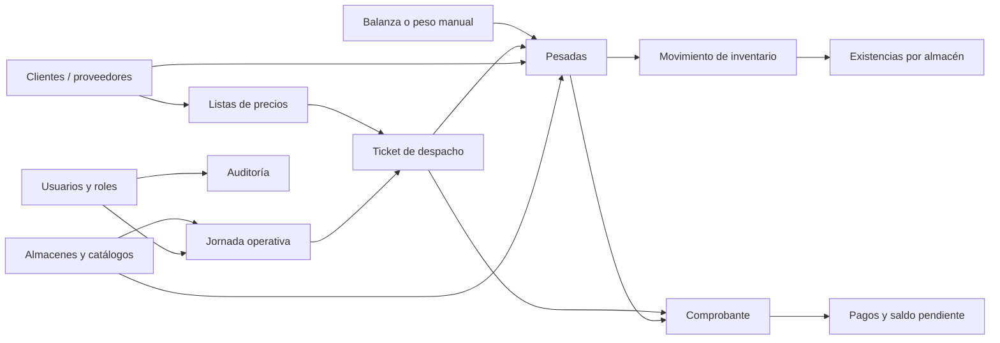
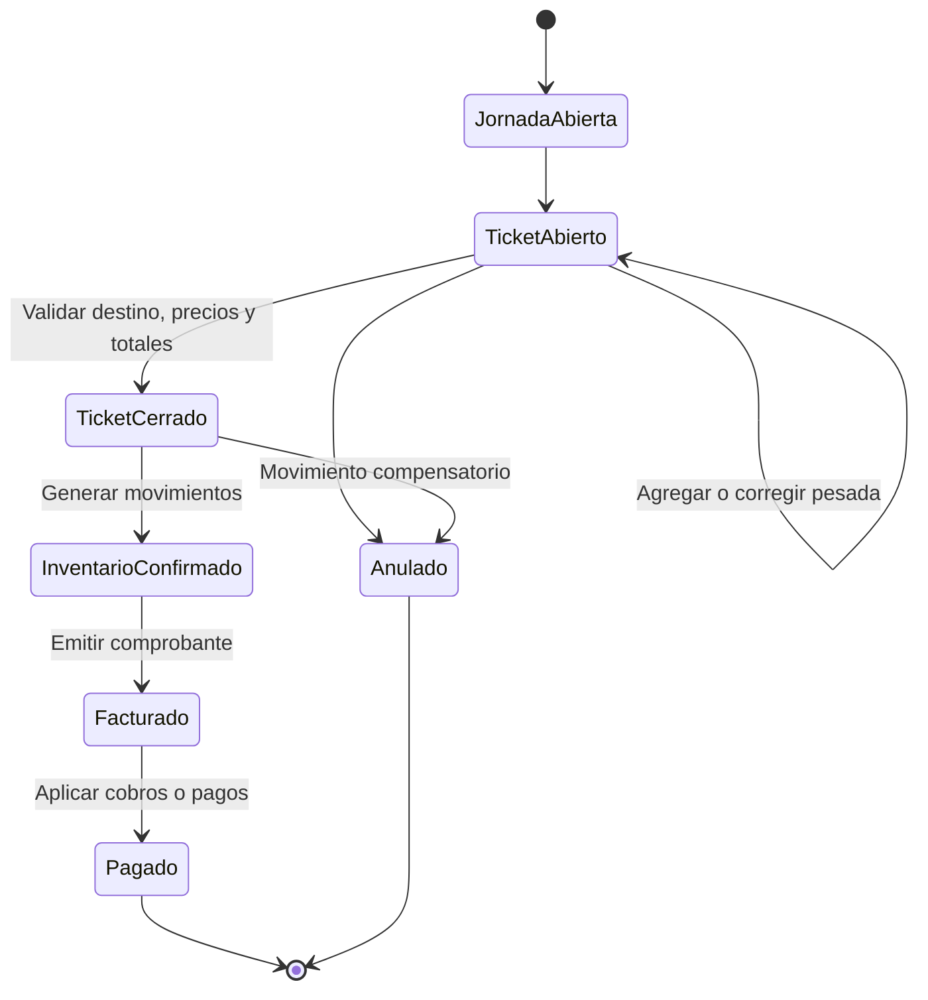

# Esquema propuesto de base de datos

Este documento define una estructura inicial para llevar el frontend actual de
**Sistema Pollos** a una base de datos relacional ordenada y preparada para
producción.

El diseño cubre:

- clientes y proveedores;
- precios de compra y venta por tipo de pollo;
- almacenes, vehículos, balanzas y tipos de java;
- jornadas de trabajo, tickets de despacho y pesadas;
- movimientos y existencias de inventario;
- comprobantes, pagos y facturación futura;
- usuarios, permisos y auditoría.

La propuesta es compatible conceptualmente con MySQL/MariaDB, que suele ser la
opción natural en un entorno Laragon. Todavía no es una migración SQL: es el
modelo que debe validarse antes de crear las tablas.

## 1. Flujo general

## 2. Diagrama entidad-relación

El archivo [esquema-base-datos.dbml](./esquema-base-datos.dbml) contiene el
modelo completo con columnas e índices. Puede importarse en una herramienta
compatible con DBML para verlo como diagrama.

```mermaid
erDiagram
    EMPRESAS ||--o{ SUCURSALES : tiene
    EMPRESAS ||--o{ USUARIOS : registra
    USUARIOS ||--o{ USUARIO_ROLES : recibe
    ROLES ||--o{ USUARIO_ROLES : agrupa
    ROLES ||--o{ ROL_PERMISOS : contiene
    PERMISOS ||--o{ ROL_PERMISOS : habilita

    EMPRESAS ||--o{ TERCEROS : administra
    TERCEROS ||--o{ TERCERO_ROLES : puede_ser
    TERCEROS ||--o{ LISTAS_PRECIOS : posee
    LISTAS_PRECIOS ||--o{ LISTA_PRECIO_DETALLES : contiene
    TIPOS_POLLO ||--o{ LISTA_PRECIO_DETALLES : valoriza

    SUCURSALES ||--o{ ALMACENES : contiene
    SUCURSALES ||--o{ BALANZAS : utiliza
    EMPRESAS ||--o{ VEHICULOS : registra
    SUCURSALES ||--o{ JORNADAS_OPERATIVAS : abre
    USUARIOS ||--o{ JORNADAS_OPERATIVAS : opera

    JORNADAS_OPERATIVAS ||--o{ TICKETS_DESPACHO : agrupa
    TERCEROS o|--o{ TICKETS_DESPACHO : cliente_destino
    ALMACENES o|--o{ TICKETS_DESPACHO : almacen_destino
    TICKETS_DESPACHO ||--o{ TICKET_PRECIOS : congela
    TIPOS_POLLO ||--o{ TICKET_PRECIOS : aplica

    BALANZAS ||--o{ LECTURAS_BALANZA : produce
    TICKETS_DESPACHO ||--o{ PESADAS : contiene
    TIPOS_POLLO ||--o{ PESADAS : clasifica
    TIPOS_JAVA ||--o{ PESADAS : descuenta_tara
    LECTURAS_BALANZA o|--o| PESADAS : respalda
    TERCEROS o|--o{ PESADAS : proveedor_origen
    ALMACENES o|--o{ PESADAS : almacen_origen
    VEHICULOS o|--o{ PESADAS : transporta

    TICKETS_DESPACHO ||--o{ MOVIMIENTOS_INVENTARIO : genera
    MOVIMIENTOS_INVENTARIO ||--o{ MOVIMIENTO_DETALLES : contiene
    PESADAS ||--o| MOVIMIENTO_DETALLES : sustenta
    ALMACENES o|--o{ MOVIMIENTOS_INVENTARIO : origen
    ALMACENES o|--o{ MOVIMIENTOS_INVENTARIO : destino
    ALMACENES ||--o{ EXISTENCIAS_ALMACEN : mantiene
    TIPOS_POLLO ||--o{ EXISTENCIAS_ALMACEN : acumula

    EMPRESAS ||--o{ COMPROBANTES : emite
    TERCEROS ||--o{ COMPROBANTES : contraparte
    COMPROBANTES ||--o{ COMPROBANTE_DETALLES : detalla
    COMPROBANTES ||--o{ COMPROBANTE_TICKETS : relaciona
    TICKETS_DESPACHO ||--o{ COMPROBANTE_TICKETS : factura
    COMPROBANTES ||--o{ COMPROBANTE_PESADAS : relaciona
    PESADAS ||--o{ COMPROBANTE_PESADAS : sustenta
    TERCEROS ||--o{ PAGOS : realiza_recibe
    PAGOS ||--o{ PAGO_APLICACIONES : distribuye
    COMPROBANTES ||--o{ PAGO_APLICACIONES : cancela

    USUARIOS ||--o{ AUDITORIA_EVENTOS : ejecuta
```

## 3. Tablas por módulo

### Configuración y seguridad

| Tabla | Responsabilidad |
|---|---|
| `empresas` | Datos legales y configuración principal del negocio. |
| `sucursales` | Locales o centros operativos de la empresa. |
| `usuarios` | Acceso de operadores y administradores. |
| `roles`, `permisos` | Catálogo de perfiles y acciones permitidas. |
| `usuario_roles`, `rol_permisos` | Relaciones muchos-a-muchos de seguridad. |
| `auditoria_eventos` | Historial de creación, edición, anulación y cierre. |

### Catálogos

| Tabla | Responsabilidad |
|---|---|
| `terceros` | Datos comunes de personas o empresas: nombre, DNI/RUC, dirección y contacto. |
| `tercero_roles` | Permite que un tercero sea cliente, proveedor o ambos. |
| `almacenes` | Almacenes disponibles como origen o destino. |
| `tipos_pollo` | Pollo vivo, pelado, beneficiado y futuros productos. |
| `tipos_java` | Peso unitario de cada tipo de java. |
| `balanzas` | Configuración de dispositivos físicos. |
| `vehiculos` | Placas conocidas; la pesada también conserva una copia de la placa. |

### Precios

| Tabla | Responsabilidad |
|---|---|
| `listas_precios` | Cabecera de una tarifa general, de cliente o de proveedor, con vigencia. |
| `lista_precio_detalles` | Precio por kilogramo y tipo de pollo. |
| `ticket_precios` | Copia inmutable del precio aplicado al cerrar o valorizar un ticket. |

No debe consultarse el precio actual para recalcular un ticket histórico. El
precio usado se copia en `ticket_precios`, de modo que un cambio futuro no
altere ventas o compras anteriores.

### Operación diaria

| Tabla | Responsabilidad |
|---|---|
| `jornadas_operativas` | Apertura y cierre de un día o turno de trabajo. |
| `tickets_despacho` | Agrupa las pesadas que comparten un destino. |
| `lecturas_balanza` | Lectura capturada y trama original enviada por la balanza. |
| `pesadas` | Registro principal de aves, javas, pesos, origen, placa y tipo de pollo. |

En el frontend actual:

- `state.trucks` corresponde a `tickets_despacho`;
- cada objeto de `truck.cages` corresponde a una fila de `pesadas`;
- `clientId` corresponde al cliente o almacén de destino;
- `origenId` corresponde al proveedor o almacén de origen;
- `generalPricesKg` y `pricesKg` pasan a listas de precios;
- `CHICKEN_TYPES`, `CRATE_TYPES` y las balanzas pasan a tablas de catálogo.

### Inventario

| Tabla | Responsabilidad |
|---|---|
| `movimientos_inventario` | Cabecera de entrada, salida, transferencia, directo o ajuste. |
| `movimiento_detalles` | Cantidades y kilogramos afectados, respaldados por una pesada. |
| `existencias_almacen` | Saldo rápido por almacén y tipo de pollo. |

`movimiento_detalles` es el historial que explica el stock. La tabla
`existencias_almacen` es un saldo acumulado para consultas rápidas y debe
actualizarse dentro de la misma transacción que registra el movimiento.

### Facturación y pagos

| Tabla | Responsabilidad |
|---|---|
| `comprobantes` | Factura, boleta, nota o documento de compra/venta. |
| `comprobante_detalles` | Productos, kilogramos, precio e importe del documento. |
| `comprobante_tickets` | Vincula comprobantes de venta con tickets. |
| `comprobante_pesadas` | Vincula comprobantes de compra con pesadas de proveedores. |
| `pagos` | Cobros a clientes o pagos a proveedores. |
| `pago_aplicaciones` | Distribuye un pago entre uno o varios comprobantes. |

## 4. Reglas obligatorias de integridad

1. Un tercero puede tener los roles `CLIENTE` y `PROVEEDOR` al mismo tiempo,
   pero no puede repetir el mismo rol.
2. `numero_documento` debe ser único dentro de una empresa.
3. Un ticket debe tener exactamente un destino: `cliente_destino_id` o
   `almacen_destino_id`, nunca ambos.
4. Una pesada debe tener exactamente un origen: `proveedor_origen_id` o
   `almacen_origen_id`, nunca ambos.
5. Si el origen es un proveedor, debe existir una placa válida en
   `placa_snapshot`. Para un origen interno puede quedar vacía.
6. `cantidad_aves = aves_por_java * cantidad_javas`.
7. `tara_total_kg = cantidad_javas * peso_java_kg_snapshot`.
8. `peso_neto_kg = peso_bruto_kg - tara_total_kg`, y debe ser mayor que cero.
9. Los pesos deben almacenarse como `DECIMAL`, nunca como `FLOAT`.
10. Un ticket cerrado no debe editarse directamente. Una corrección se realiza
    anulando y generando el movimiento compensatorio correspondiente.
11. Clientes, proveedores, productos y almacenes usados históricamente no se
    eliminan físicamente; se marcan como inactivos.
12. La creación de una pesada, su movimiento de inventario y la actualización
    de existencias deben ejecutarse en una sola transacción.
13. Todo cierre, anulación, cambio de precio o edición de una pesada debe
    registrarse en `auditoria_eventos`.

## 5. Tipos de datos recomendados

| Dato | Tipo recomendado |
|---|---|
| Claves internas | `BIGINT UNSIGNED` autoincremental |
| Códigos visibles | `VARCHAR` con índice único por empresa o sucursal |
| Kilogramos | `DECIMAL(12,3)` |
| Precio por kg | `DECIMAL(12,4)` |
| Importes monetarios | `DECIMAL(14,2)` |
| Cantidad de aves/javas | `INT UNSIGNED` |
| Fecha operativa local | `DATE` |
| Fecha y hora técnica | `TIMESTAMP` almacenado en UTC |
| Estados y tipos controlados | catálogo o `ENUM` según la política del backend |
| Datos antes/después de auditoría | `JSON` |

## 6. Orden sugerido para construir la base

1. Empresa, sucursal, usuarios, roles y permisos.
2. Terceros, roles de terceros y catálogos operativos.
3. Listas de precios y sus detalles.
4. Jornadas, tickets, lecturas de balanza y pesadas.
5. Movimientos y existencias de inventario.
6. Comprobantes, relaciones de facturación y pagos.
7. Auditoría, reportes, respaldos e índices de rendimiento.

## 7. Datos iniciales del sistema

Al instalar la base deben registrarse, como mínimo:

| Catálogo | Registros iniciales |
|---|---|
| `tipos_pollo` | `POLLO_VIVO`, `POLLO_PELADO`, `POLLO_BENEFICIADO` |
| `tipos_java` | `JAVA_700` con 7.000 kg y `JAVA_690` con 6.900 kg |
| `almacenes` | `ALMACEN_1` y `ALMACEN_2` |
| `balanzas` | `BALANZA_1` y `BALANZA_2` |
| `roles` | `ADMINISTRADOR`, `OPERADOR`, `FACTURACION`, `CONSULTA` |
| lista general | Precios iniciales de compra y venta por tipo de pollo |

Los diez tickets que aparecen hoy en pantalla no deben cargarse como diez
camiones permanentes. Al abrir una jornada se pueden crear los tickets
necesarios, usando una numeración como `T-20260620-001`.

## 8. Ciclo de vida recomendado

## 9. Decisiones pendientes antes del SQL definitivo

- confirmar si habrá una sola empresa o varias empresas usando el sistema;
- confirmar el país fiscal, la moneda y la zona horaria de operación;
- confirmar si cada día tendrá una sola jornada o varios turnos;
- definir series y tipos reales de comprobantes;
- confirmar si se necesita facturación electrónica con SUNAT;
- decidir si el pollo beneficiado también podrá despacharse desde esta pantalla;
- definir si las transferencias entre almacenes necesitan aprobación;
- definir los datos adicionales de vehículos y conductores;
- confirmar si el precio del proveedor representa costo de compra;
- definir la política de redondeo fiscal y de pesos;
- definir cuánto tiempo se conservarán las tramas crudas de las balanzas.
